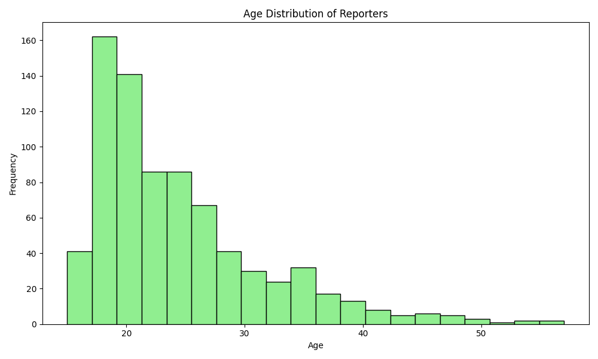
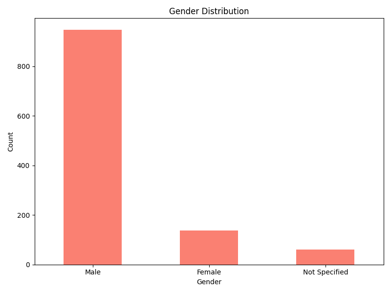
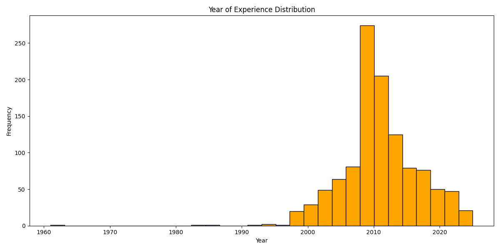
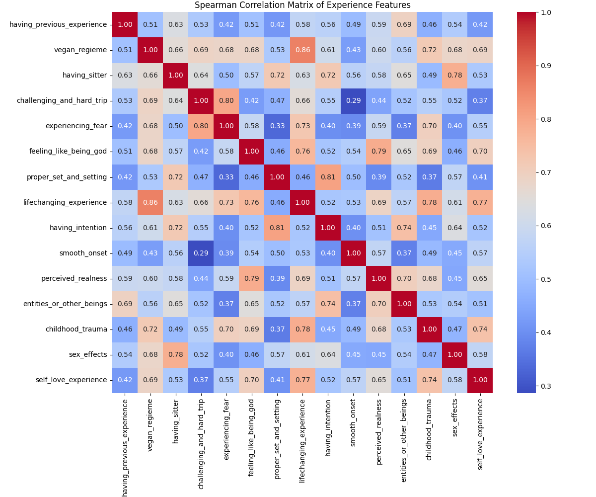
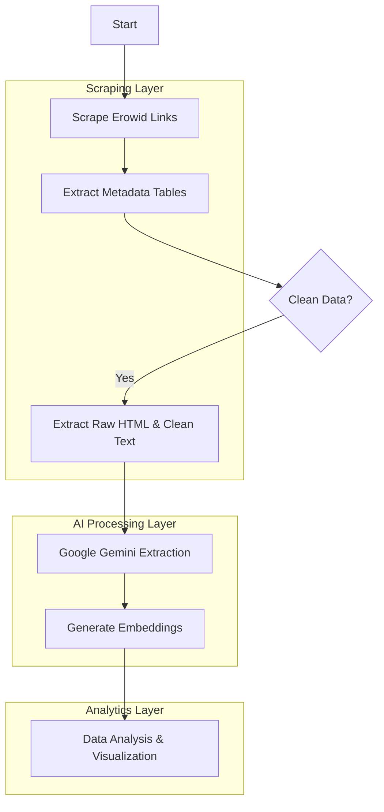

# Erowid Trip Report Analysis Pipeline

This project implements a comprehensive pipeline for scraping, cleaning, analyzing, and visualizing **DMT trip reports** from a subset of [Erowid's](https://www.erowid.org/) database. It leverages advanced NLP techniques, including Google's Gemini LLM and semantic embeddings, to extract structured data from unstructured narratives.

> [!NOTE]
> **Scope & Disclaimer**: This is a **personal investigation** conducted on a specific portion of DMT experiences. The results presented here are preliminary findings from this subset, and **more investigation is needed** to draw broader conclusions.

## 🚀 Features
- **Automated Scraping**: Robust `BeautifulSoup` scrapers to harvest experience reports and metadata (Dosage, Body Weight, Gender, etc.).
- **Data Cleaning**: HTML parsing and text normalization pipelines to prepare raw data for analysis.
- **LLM Information Extraction**: Utilizes **Google Gemini 1.5 Flash** to extract complex semantic fields such as "Intention", "Visuals", "Entities", and "Life Changes" from free-text reports.
- **Semantic Analysis**: Generates embeddings (using Gemma/SentenceTransformers) for clustering and similarity search.
- **Data Visualization**: Automated generation of statistical charts to understand demographics and substance usage patterns.

## 📊 Results & Analysis

Here are some insights generated from the analyzed reports:

### 1. Substance Distribution
The most common substances found in the dataset.


### 2. Demographics (Age)
Age distribution of the individuals reporting the experiences.


### 3. Gender Distribution
Gender breakdown of the report authors.


### 4. Experience Timeline
Distribution of the years when the experiences occurred.


### 5. Schema Correlations & Insights
Using the `schemasearchforembedding.ipynb` notebook, we performed a deep-dive analysis into the correlations between different experience variables (e.g., "Having Intention", "Set and Setting", "Life-Changing Experience").

**Key Findings:**
- **Diet & Impact**: A surprisingly high correlation (**0.86**) was observed between adhering to a **Vegan Regime** and reporting a **Life-Changing Experience**.
- **Preparation Matters**: **Having an Intention** is strongly correlated (**0.80**) with having a **Proper Set and Setting**, reinforcing the importance of preparation.
- **Fear & Difficulty**: **Experiencing Fear** and a **Challenging/Hard Trip** are tightly linked (**0.80**), which aligns with the "bad trip" phenomenology.
- **Divine Encounters**: Reports of **Perceived Realness** strongly correlate (**0.79**) with **Feeling like being God**.



---

## 🛠️ Technical Implementation & Flow

The project follows a linear data processing pipeline:



### Detailed Workflow

1.  **Data Collection (`tripreport2.py`)**:
    *   **Link Scraping**: Iterates through Erowid index pages (e.g., `S1=18`) to collect URLs of individual reports.
    *   **HTML Extraction**: Downloads the full HTML source of each report.
    *   **Metadata Parsing**: specific tables (DoseChart, BodyWeight, FootData) are parsed into structured JSON to retrieve fields like `Age`, `Gender`, and `Dosage`.

2.  **Data Cleaning**:
    *   Raw HTML is processed to strip tags and isolate the main narrative text using comment markers (`<!-- Start Body -->`, `<!-- End Body -->`).

3.  **Semantic Extraction (LLM)**:
    *   **Model**: Google Gemini 1.5 Flash.
    *   **Method**: Zero-shot optimized prompting.
    *   **Schema**: We map the unstructured text to a strict schema containing fields like `intention`, `set_and_setting`, `perceived_realness`, and `entities`.
    *   **Chunking**: Long reports are split into token-safe chunks to ensure complete analysis.

4.  **Embedding Generation (`tripreport2.1.ipynb`)**:
    *   Text chunks and extracted features are vectorized using embedding models (e.g., Gemma or SentenceTransformers).
    *   This allows for semantic search and clustering of similar trip experiences.

## 📂 Repository Structure

- `tripreport2.py`: Main script for scraping, cleaning, and initial LLM processing.
- `tripreport2.1.ipynb`: Advanced analysis and embedding generation notebook.
- `dmt data/`: Directory containing the processed datasets (JSON) and embeddings.
- `images/`: Generated charts and visualizations.
- `generate_charts.py`: Utility script to regenerate visualizations from the JSON data.

## ⚙️ Setup & Usage

1.  **Install Dependencies**:
    ```bash
    pip install -r requirements.txt
    ```

2.  **Set API Keys**:
    Ensure your `GOOGLE_API_KEY` is set in `config.py` or environment variables for Gemini access.

3.  **Run the Pipeline**:
    ```bash
    # To run scraping and extraction
    python tripreport2.py
    
    # To regenerate charts
    python generate_charts.py
    ```

## 📈 Future Work

- Implement interactive dashboards for exploring embeddings.
- Fine-tune a small SLM (Small Language Model) specifically for trip report classification.
- Cross-reference extracted dosage data with subjective intensity scores.
